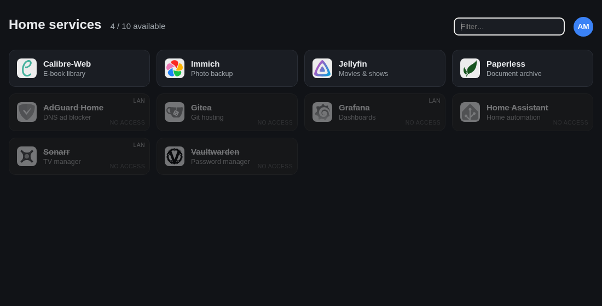
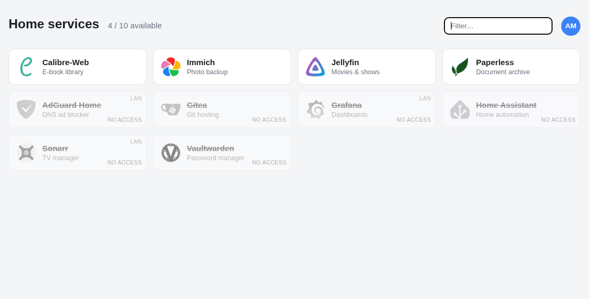

# myDashboard

A small dashboard for a homelab behind [Authelia](https://www.authelia.com/). It shows **every service you run, and crosses out the ones the signed-in person is not allowed to use**, so each user sees what exists and what they can open.

| Dark | Light |
|---|---|
|  |  |

*(demo data: `python -m mydashboard.demo`)*

## Why

Dashboards like Homepage, Glance or Dynacat are great at listing services, but they show the same page to everyone. Authelia already knows who may use what. myDashboard connects the two: services are discovered from your Docker labels, access rules are read from your Authelia setup, and the page adapts to the person looking at it.

## Features

- **Auto-discovery** from container labels (Dynacat/Glance style `dynacat.name`, `dynacat.url`, `dynacat.icon`, `dynacat.description`).
- **Per-user view**: tiles the user cannot open are greyed out and crossed out, with a tooltip saying which groups would give access.
- **Access rules come from Authelia** (forward-auth rules and OIDC clients), with no extra labels to maintain. A small `overrides.yml` covers what Authelia cannot know (apps that use LDAP directly, LAN-only apps, hidden services).
- **Safe defaults**: a service with no known rule is only open to `default_groups` (admins unless you say otherwise).
- Options to list **only public** services and/or **only services that use your SSO**.
- Account menu: who you are, your groups, links to your Authelia settings and logout, theme switch (auto, light, dark) and an "open in a new tab" checkbox, both saved in the browser.
- No database, one small container, a few hundred lines of Python.

## How it works

```
Docker labels ──(read-only socket proxy)──┐
Authelia configuration ──(export, sanitized)──► merge ──► page for the user in Remote-Groups
overrides.yml (your exceptions) ──────────┘
```

Details in [docs/ARCHITECTURE.md](docs/ARCHITECTURE.md). Every setting is listed in [docs/CONFIGURATION.md](docs/CONFIGURATION.md).

## Quick start

Try it without Docker or Authelia (fake data from `demo/`):

```bash
pip install -r requirements.txt
PYTHONPATH=src python -m mydashboard.demo --user alice --groups family
# open http://127.0.0.1:8080
```

Run it for real:

```bash
cp config/overrides.example.yml config/overrides.yml     # edit it
mkdir -p data
PYTHONPATH=src python3 -m mydashboard.authelia_export /path/to/authelia/configuration.yml data/rules.json
docker compose -f docker-compose.example.yml up -d
```

Then put it behind Authelia in your reverse proxy: see [docs/DEPLOY.md](docs/DEPLOY.md).

## Requirements

- Authelia in front of the reverse proxy (`forward_auth`), sending the `Remote-User`, `Remote-Groups`, `Remote-Name` and `Remote-Email` headers.
- Docker, and containers labelled with `dynacat.name` and `dynacat.url` (any container without both is ignored).
- Python 3.11+ and PyYAML on the machine that runs the Authelia export (the exporter is a plain script, so a cron job is enough).

## Security model, in short

- The dashboard **trusts the `Remote-*` headers**, so it must only be reachable through your authenticated proxy. Do not publish its port. `TRUST_TOKEN` adds a shared secret between the proxy and the dashboard.
- It is **a list of links**. Authelia and each app still enforce access. Crossing a tile out does not protect anything by itself.
- It never reads Authelia's configuration at runtime (that file holds your OIDC signing key). A separate export step writes only domains and group names.
- It never gets the Docker socket, only the container list through [docker-socket-proxy](https://github.com/Tecnativa/docker-socket-proxy).

Read [SECURITY.md](SECURITY.md) before exposing it.

## Built with AI ("vibe coded")

This project was **written with an AI coding assistant (Claude Code)**, steered by a human who described what they wanted, read the results and tested them on a real homelab. It is not a hand-audited codebase. In practice that means:

- It works for the author's setup and has unit tests (`pytest`), but it has **not had an independent security review**.
- Some design choices were made quickly. Expect rough edges, and read the code before you trust it with anything sensitive.
- The tests, lint (`ruff`) and a demo mode are there so you can check behaviour yourself, and issues and pull requests are welcome.

If AI-assisted code is not for you, that is a fair call. Nothing is hidden: every change is in the git history.

## Limitations

- Rules come from a snapshot of Authelia's config (`rules.json`). Re-run the export when your rules change (a cron every few minutes works).
- Only simple Authelia subjects are understood: `group:<name>` and "any signed-in user". AND-combinations and `user:` subjects are ignored (the export notes them).
- Authelia cannot tell the dashboard which apps use LDAP or their own login, hence the overrides file.
- Icons are loaded by the visitor's browser from public CDNs (`jsdelivr`, `simpleicons`). Point `icon` at your own URL if that matters to you.

## Develop

```bash
pip install -r requirements-dev.txt
ruff check . && python -m pytest -q
PYTHONPATH=src python -m mydashboard.demo
```

See [CONTRIBUTING.md](CONTRIBUTING.md).

## License

[MIT](LICENSE)
